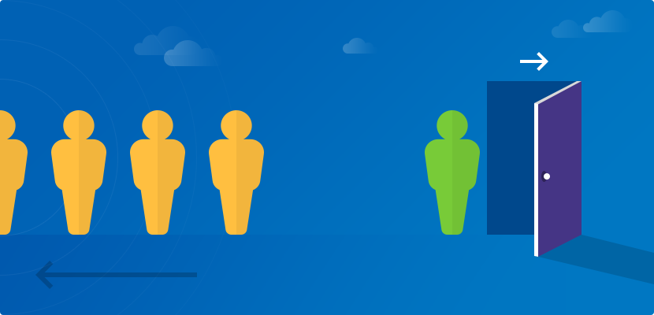

# Telecom Customer Attrition Classification Analysis

## Introduction

Voluntarily customer attrition is the customers' decision to make a stop in purchasing the company's product or service. This loss is often caused by the customers' perception that the company's products are no longer align with the customers' needs and/or values. According to a study by Bain & Company and the Harvard Business School, decreasing customer attrition rate by 5% will increase the company profits by 25% to 95%. On the other hand, although both new and existing customer groups cannot be neglected, numerous articles have demonstrated that acquiring new customers is more expensive than retaining existing customers. Therefore, analysis of customer attrition is absolutely important to help a company understand the causes of customer churn and gain new insight into its strategic planning for future improvement.

## Methodology and Approach

This project is followed the OSEMN framework with the usage of five different classifiers:

1. Logistic Regression
2. Random Forest
3. K-Nearest Neighbor
4. Decision Tree
5. XGBoost 

## Appendix for Files
- Data Cleaning: <a href="https://github.com/linhmai19/telecom_customer_attrition_analysis/blob/master/data_cleaning.ipynb">data_cleaning.ipynb</a>

- EDA and modeling: <a href="https://github.com/linhmai19/telecom_customer_attrition_analysis/blob/master/customer_churn_analysis.ipynb">customer_churn_analysis.ipynb</a>

## Dataset:
- Raw data: <a href="https://github.com/linhmai19/telecom_customer_attrition_analysis/blob/master/customer_churn.csv">customer_churn.csv</a>

- Cleaned data: <a href="https://github.com/linhmai19/telecom_customer_attrition_analysis/blob/master/cleaned_customer_churn.csv">cleaned_customer_churn.csv</a>

## Non-technical Presentation

<a href="">customer_churn_presentation.pdf</a>

## Walkthrough Video

<a href="">Oral Presentation</a>

## Blog post

<a href="">Telecom Customer Attrition Analysis</a>

## Reference 
The raw dataset was downloaded from Kaggle and the data was collected from SyriaTel company 

<a href="https://www.kaggle.com/becksddf/churn-in-telecoms-dataset">Churn in Telecom's Dataset</a>

